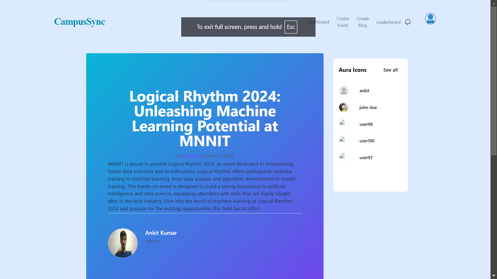
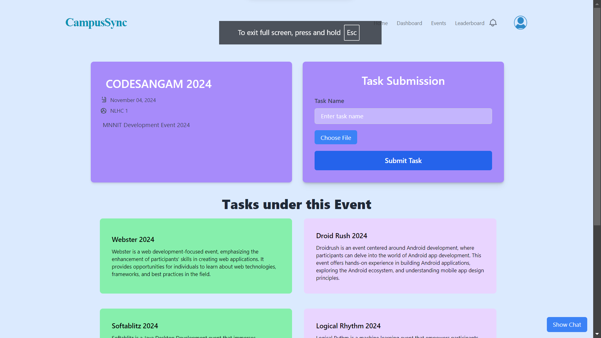
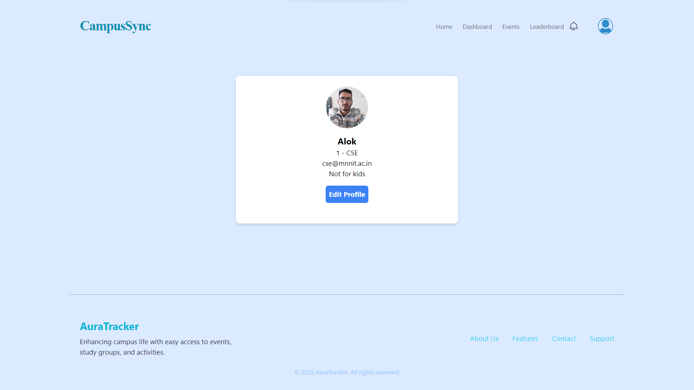

## Hash3

# CampusSync (CodeSangam 2024)


This project is a Campus College Tracker Web App that gamifies academic life for college students, making studying, attending lectures, and participating in campus events more engaging and rewarding. It’s designed for students juggling multiple responsibilities who need help staying organized and motivated.


## Environment Variables

To run this project, you will need to add the following environment variables to your .env file

`PORT`

`SECOND_PORT`

`MONGO_DB_URI`

`GOOGLE_CLIENT_ID`

`GOOGLE_CLIENT_SECRET`

`GOOGLE_CALLBACK`

`SESSION_SECRET`

`CLOUDINARY_CLOUD_NAME`

`CLOUDINARY_API_KEY`

`CLOUDINARY_API_SECRET`

`CLOUDINARY_URL`

## Run Locally

Project Structure

```bash
CampusSync
├── server
│   ├── server.js
│   ├── SecondServer.js
│   ├── .env
│   │ ...
│   └── package.json
├── client
│   ├── index.html
│   ├── src
│   │   ├── main.jsx
│   │   │ ...
│   │   └── index.css
│   │ ...
│   └── package.json
├── .gitignore
└── README.md
```

Clone the project

```bash
  $ git clone https://github.com/1820ANKIT2029/CampusSync.git
```

Go to the CampusSync

```bash
  $ cd CampusSync
```

# server

Install dependencies for server

```bash
  $ cd server
  $ npm install
```

Start the servers (HTTP Server and Socket Server)

```bash
  $ npm run start & npm run start:secondServer
```

Stop servers (note: PID of server run in bg)

```bash
  $ kill <PID1> <PID2>
  or
  $ npm run stop
```

# client

Install dependencies for client

```bash
  $ cd client
  $ npm install
```

Start the client server

```bash
  $ npm run dev
```

Stop client server

```bash
  $ ^C
```


## Project Demo

Here’s a quick preview of the app:



Home page after LoggedIn



Event Page



Profile Page


## Developers

- [Alok Negi](https://github.com/aloknegi786) (Developer, Leader)
- [Ankit Kumar](https://github.com/1820ANKIT2029) (Developer)

